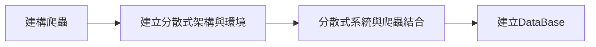

# Work Report

## Process Plot

## sys structure

## work path in linux
start parallel sys by run 
**/home/{username}/psc/parallel_crawler_sys/v4/financialdata/{start_file}**

### Start Step
1. start docker ==> sudo service docker start
2. cd to project path => cd /home/{username}/psc/parallel_crawler_sys/v4/financialdata/{start_file}
3. turn on all monitor panels
   1. Docker Portainer => localhost:9000
   2. RabbitMQ => localhost:15672
   3. Flower => localhost:5555
4. sent tasks to RabbitMQ to storage => run producer.py
   1. run command lines : python3 producer.py {crawler_name} {start_time (format : yyyy:mm:dd)} {end_time (format : yyyy:mm:dd)}
   2. crawler selections
      1. weather_crawler
      2. udn_news_crawler
5. command workers to do tasks (worker.py) => celery -A worker worker --loglevel=info --concurrency=1  --hostname=%h -Q celery

## Python Env Setting (Package)
